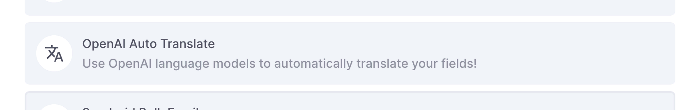
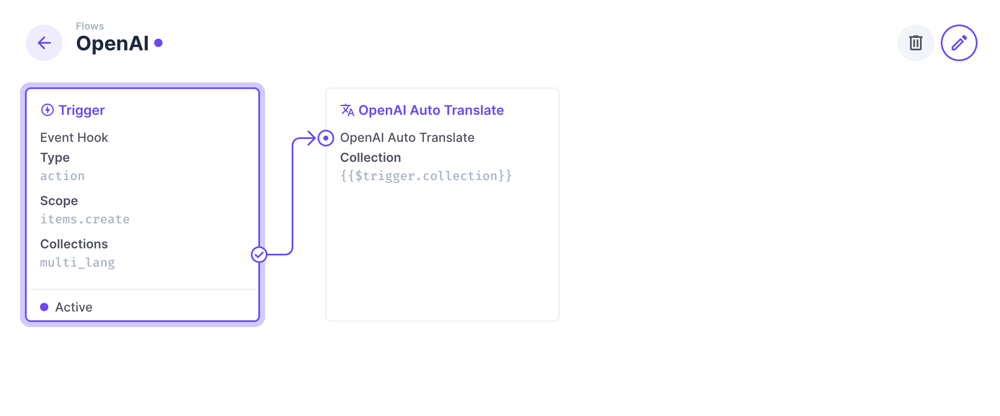
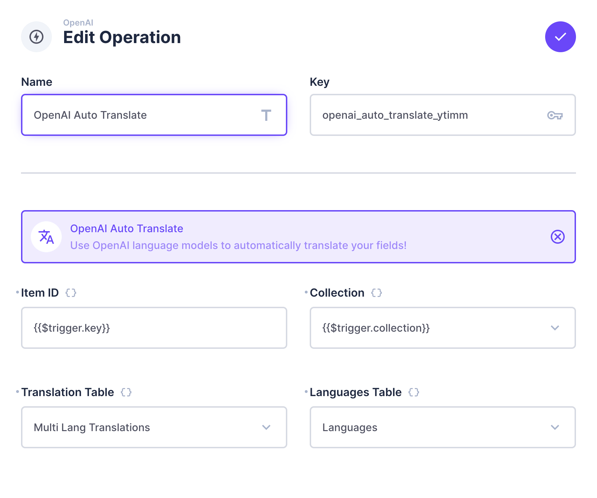
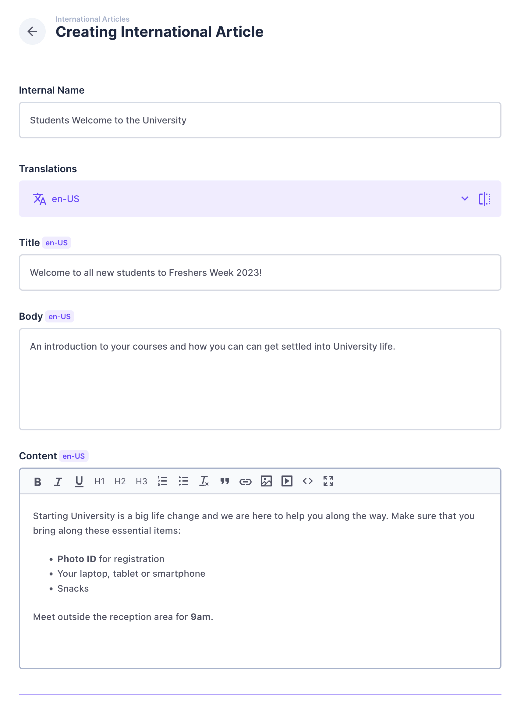
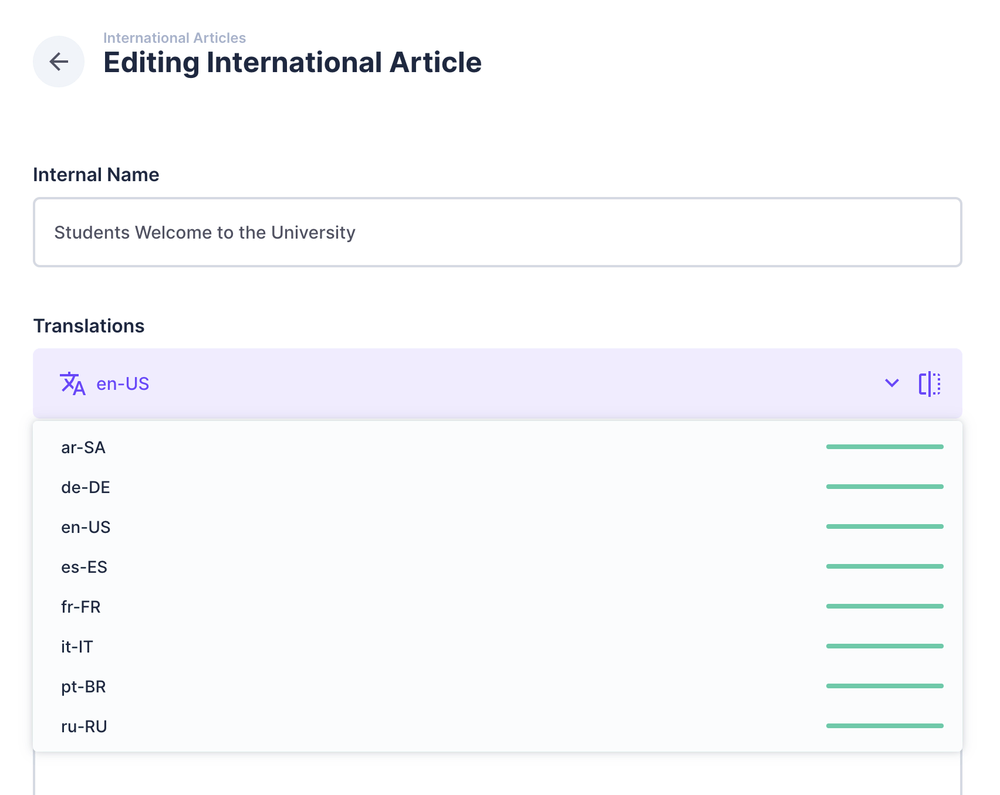
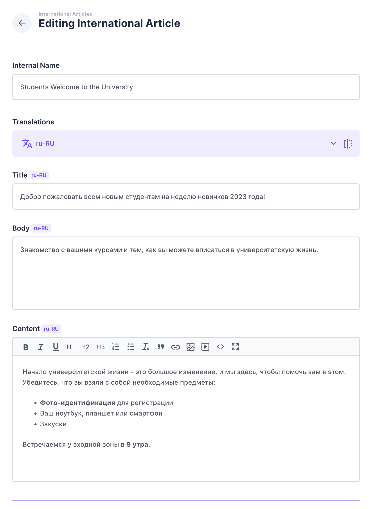

# OpenAI Automatic Translation

Use ChatGPT language models to automatically translate your content through Directus Flows!

## Details

- This extension will solve the issue of poor translations by utilizing the OpenAI language models to more accurately translate your content in the absense of multi-lingual staff.
- Uses the OpenAI library to simplify the API interaction.
- This extention is known as an operation which is part of Flows. This allows this functionality to be customized to suit the majority of use cases.
- Given more time, I would branch out to other AI translation models and include notifications once the translations are complete.

## Requirements

- OpenAI API key with credits [OpenAI.com](https://platform.openai.com)
- Create a collection with a translation field
- Make note of the collections that are created. Usually *languages* and *<collection name>_translations*

## How to use this Operation

1. Add this extension into the project's extensions/operations folder
2. Update your project's environment file with the following:
```javascript
OPENAI_API_KEY="sk-XXXXXXXXXXXXXXXXXXX"
OPENAI_RATE_LIMIT="21000"
```
The rate limit is in ms. By default ChatGPT limits free trial accounts to 3 API calls per minute. Setting this to 21000 (21 seconds) ensures this limit is not reached.

3. Start/Restart Directus
4. Create a new Flow with an Event trigger for your collection. I recommend using the item.create event
5. Add a new operation to your flow and choose OpanAI Auto Translate
6. Set the item ID to {{$trigger.key}} and collection to {{$trigger.collection}} 
7. Choose the translations collection and languages collection from the list, then Save and close the Flow
8. Create a new item and wait a couple minutes (depending on your rate limit)

## Screenshots

This is how it appears in the list of Operations when adding to a Flow.


Flow using this Operation


Example of the operation settings


Creating a new item in the collection


After a few minutes, opened the item and clicked the language dropdown. The progress bar for each translation is complete.


Example of the Russian translation performed by ChatGPT 3.5 Turbo
